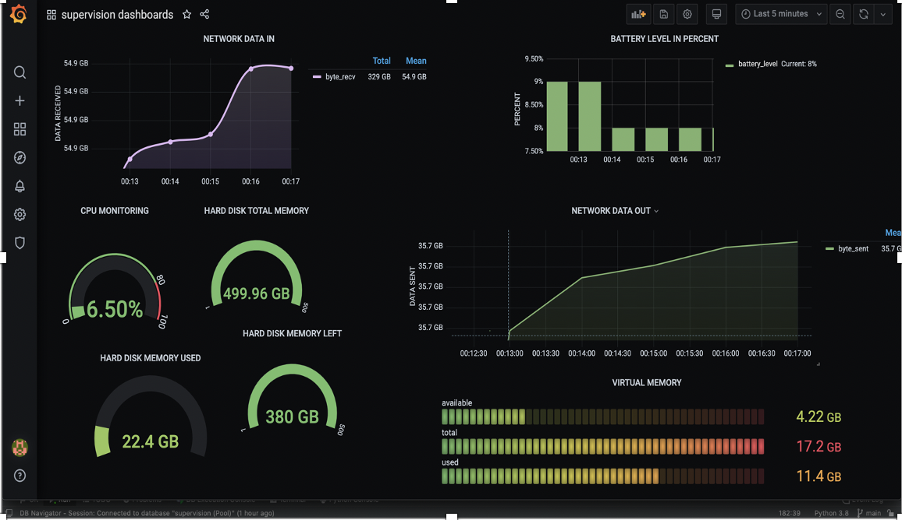

# python_scripting_supervision

It's a programm dedictaed to monitoring several parts of my labtop and getting the datas out into a text file and then into a SQL database (Workbench). Next the dats are uploaded into a data vizualisation tool which allows me to have an overview of my labtop state at a specific time through graphics. 

ressources :
  - python (PyCharm)
  - PSUTIL library -> grab the functions related to each element i want to monitor  
  - time library -> to create a refresh process to upload new bashes of datas every 10 seconds 
  - datetime library -> to time stamp every upload of datas into the text file .txt
  - mariadb connector -> to be able to link the program to my sql database
  - Grafana -> data vizualisation tool
  
 
  
  

